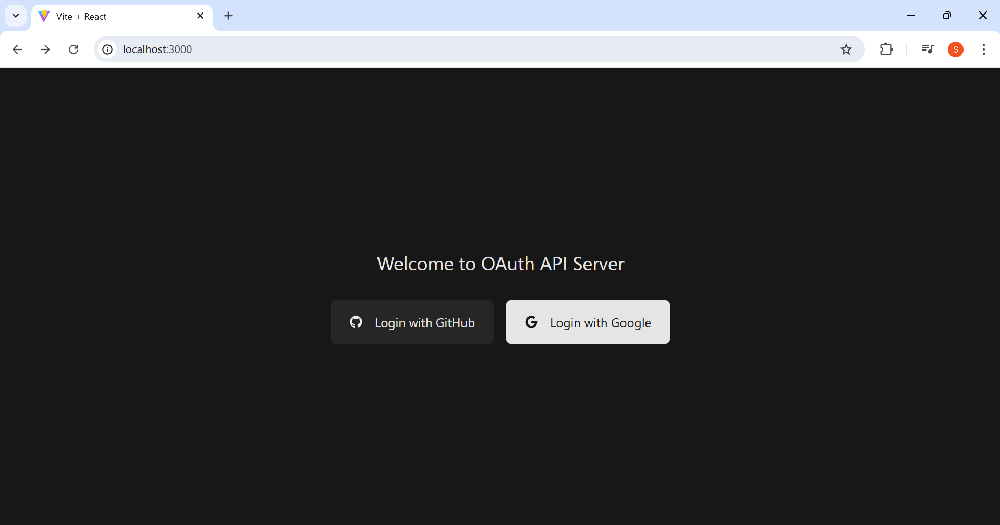
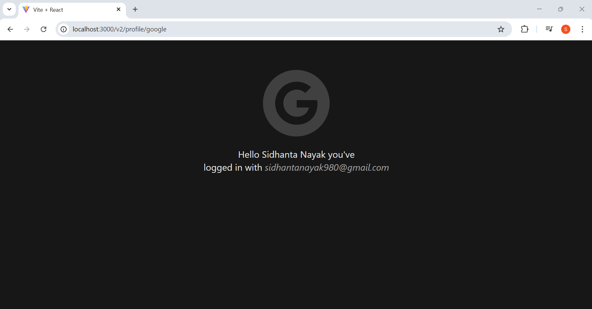

# 🌐 OAuth Authentication with GitHub & Google

## 📌 Overview
This is a simple OAuth authentication server that allows users to log in using **GitHub** or **Google**.  
It retrieves their profile information after login and securely stores an **access token** in a cookie for **60 seconds**.  
Protected routes ensure that only authenticated users can access certain endpoints.

---

## 🚀 Tech Stack
- **Frontend:** React.js  
- **Backend:** Express.js  
- **OAuth Providers:** GitHub & Google  
- **Database:** No database (Session-based authentication)  

### 🛠 Key Dependencies
- **Express.js**: Handles API requests and authentication flow.  
- **Axios**: Makes requests to GitHub/Google APIs.  
- **CORS**: Enables frontend-backend communication.  
- **Cookie-Parser**: Reads cookies from incoming requests.  
- **dotenv**: Manages environment variables.  

---

## 📋 Features
✅ Login with **GitHub** and **Google**  
✅ Retrieve user profile details   
✅ Store access token securely in **cookies** (valid for 60 seconds)  
✅ Protect certain routes (e.g., `/profile`) for authenticated users  
✅ Handle logout functionality  

---

## 📦 Installation & Setup
### 🔹 Backend Setup (Express.js)
1. Navigate to the `backend` folder:
   ```sh
   cd backend
   ```
2. Install dependencies:
   ```sh
   npm install
   ```
3. Create a `.env` file and add the following:
   ```sh
   GITHUB_CLIENT_ID=your_github_client_id
   GITHUB_CLIENT_SECRET=your_github_client_secret
   GOOGLE_CLIENT_ID=your_google_client_id
   GOOGLE_CLIENT_SECRET=your_google_client_secret
   FRONTEND_URL=http://localhost:3000
   ```
4. Start the backend server:
   ```sh
   npm start
   ```

### 🔹 Frontend Setup (React.js)
1. Navigate to the `frontend` folder:
   ```sh
   cd ../frontend
   ```
2. Install dependencies:
   ```sh
   npm install
   ```
3. Start the frontend:
   ```sh
   npm start
   ```

---

## 🔑 Authentication Flow
1. User clicks **Login with GitHub** or **Login with Google** on the frontend.  
2. The backend redirects them to the **OAuth provider’s** login page.  
3. After authentication, the provider **returns an authorization code**.  
4. The backend exchanges this code for an **access token** and retrieves user data.  
5. The backend **stores the token** in a secure **HTTP-only cookie** for 60 seconds.  
6. The user can now access protected routes (e.g., `/profile`).  
7. **Logout** removes the session and clears the cookie.  

---

## 📸 Screenshots
### 🔹 Home Page:


### 🔹 Profile Page:



---

## 🤝 Contributing
We welcome contributions!  
Follow these steps to contribute:  

1. **Fork the repository**  
2. Create a **new branch**:  
   ```sh
   git checkout -b feature-branch
   ```
3. **Make changes** and commit:  
   ```sh
   git commit -m "Added a new feature"
   ```
4. **Push to the branch**:  
   ```sh
   git push origin feature-branch
   ```
5. Open a **Pull Request**  

---

## ⭐ Support  
If you like this project, give it a ⭐ on GitHub! 😊  

